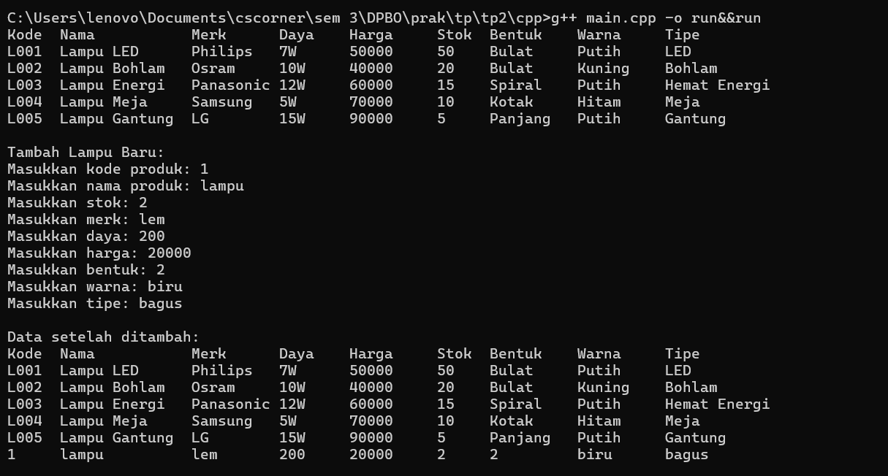

# TP2DPBO2425C2

Saya Rifa Muhammad Danindra dengan Nim 2405981 mengerjakan tugas praktikum 2 dalam mata kuliah Desain dan Pemprograman Berorientasi Objek untuk keberkahan-Nya maka saya tidak akan melakukan kecurangan seperti yang telah di spesifikasikan Aamiin.

Desain Diagram

Atribut Dan Methods

di kelas produk ada kode produk untuk kode setiap produknya lalu ada nama untuk ssetiap produk dan stok setiap produk lalu di kelas ELektronik adalah turunan dari produk yang mempunyai atribut merk untuk merk produk elektroniknya lalu ada daya untuk produk elektroniknya dan harga untuk harga produknya berapa, yang terakhir di kelaslampu ada bentuk lampunya apa karena bentuk lampu berbeda beda lalu ada warna lampu untukwarna llampu yang ada dan tipe lampu untuk tipenya seperti led, lalu ada method add untuk menambahkan data di kelas terakhir juga

Alur Program

semua bahasa
kelas produk adalah kelas orang tua dan diisi dengan atribut atributnya yaitu kode produk nama, dan stok lalu dilanjut ke kelas produk elektronik yang mewarisi atribut dari orang tuanya yaitu kelas produk dan diisi juga dengan atributnya sendiri yaitu merk, daya dan harga, lalu dilanjut ke kelas lampu yang mewarisi atirbut dari orang tuanya dan atasnya lagi dan juga diisi dengan atribut yang sendiri yaitu tipe, warna dan bentuk  dan juga ditaruh method add lalu di main akan diisi semua datanya dengan hardcode lalu akan mengeluarkan output semua data yang ada dan juga akan mengeluarkan output untuk meminta masukan dengan menggunakan method add untuk masukan data baru tapi hanya sekali 

dokumentasi
CPP

menampilkan data yang ada dan menambah data baru
Java

menampilkan data yang ada dan menambah data baru

PHP

menampilkan data yang ada dan menambah data baru

Python

menampilkan data yang ada dan menambah data baru

