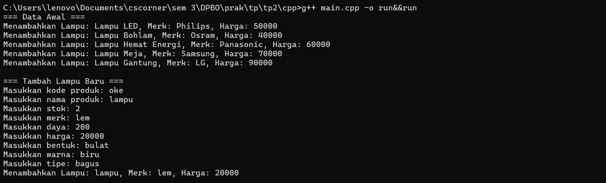
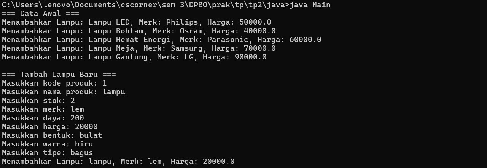
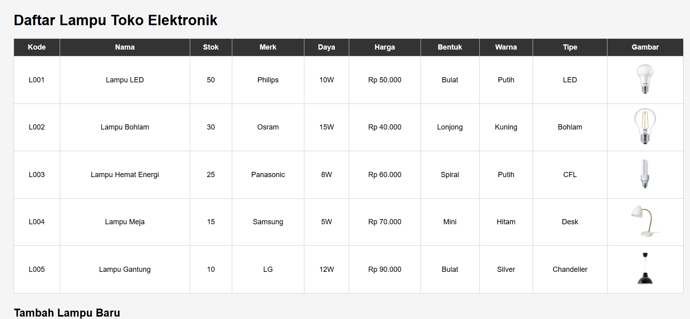
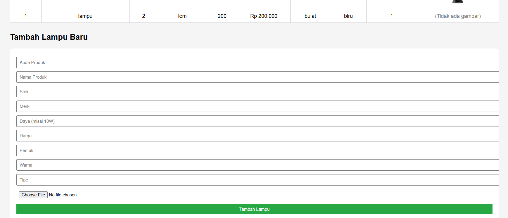
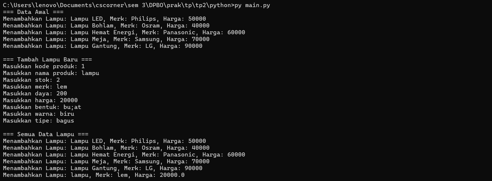

# TP2DPBO2425C2

Saya Rifa Muhammad Danindra dengan Nim 2405981 mengerjakan tugas praktikum 2 dalam mata kuliah Desain dan Pemprograman Berorientasi Objek untuk keberkahan-Nya maka saya tidak akan melakukan kecurangan seperti yang telah di spesifikasikan Aamiin.

Desain Diagram

Atribut Dan Methods

di kelas produk ada kode produk untuk kode setiap produknya lalu ada nama untuk ssetiap produk dan stok setiap produk lalu di kelas ELektronik adalah turunan dari produk yang mempunyai atribut merk untuk merk produk elektroniknya lalu ada daya untuk produk elektroniknya dan harga untuk harga produknya berapa, yang terakhir di kelaslampu ada bentuk lampunya apa karena bentuk lampu berbeda beda lalu ada warna lampu untukwarna llampu yang ada dan tipe lampu untuk tipenya seperti led, lalu ada method add untuk menambahkan data di kelas terakhir juga

Alur Program

kelas kelas berada di file masing masing di setiap bahasa lalu di mainnya akan ada pengisian hardcode dari data yang diisi lalu print keluaran dan add nya 

dokumentasi
CPP

Java

PHP

Python

